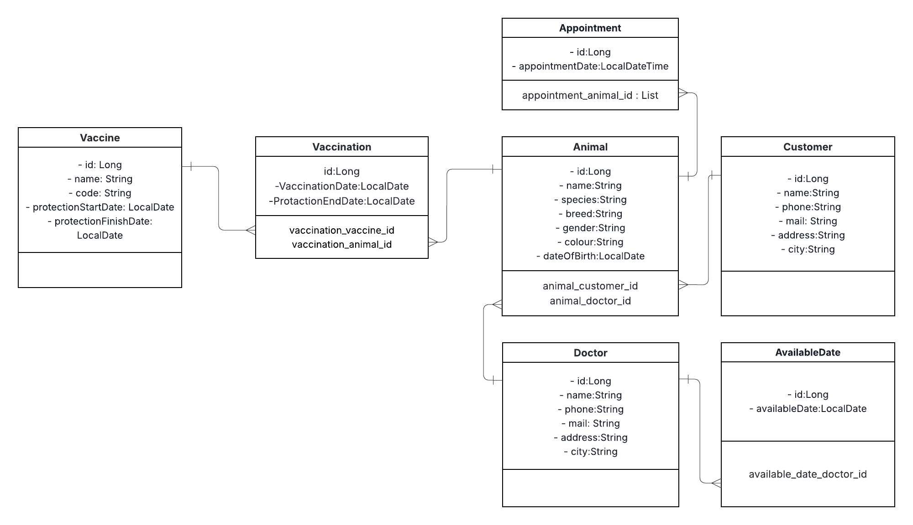

                                                                                   # 🐾 Veterinary Clinic Management System (VetMan)

A simple Spring Boot application designed to manage the core operations of a veterinary clinic, focusing on patient records (Animals) and key operations (Vaccinations, Doctors).

## ✨ Features

This project provides core **CRUD** (Create, Read, Update, Delete) functionalities for the following entities:

* **Animals (Patients):** Comprehensive record-keeping for every animal, including species, breed, color, and unique identification.
* **Customers:** Owner information for each animal.
* **Doctors:** Management of veterinary staff information.
* **Vaccines:** Registration of different vaccine types and their codes.
* **Vaccinations:** Records of applied vaccines, adhering to specific business rules.

## 🚀 Key Business Logic Implemented

The system enforces important business rules to ensure data integrity:

### 1. Unique Records

* **Doctor/Customer:** Email and phone numbers must be unique across all records.
* **Vaccine:** Each vaccine type must have a unique code.

### 2. Vaccination Rules (The "Same Vaccine Block")

* A new vaccination record for an animal cannot be created if an active vaccination of the **same type** (same vaccine code) already exists and its **protection end date** has not passed.
    * *Example:* If a Rabies shot is active until 2026-11-01, a new Rabies shot cannot be applied until after that date.

## 💻 Technology Stack

* **Backend:** Java 21+
* **Framework:** Spring Boot 3
* **Database:** PostgreSQL (Recommended for production) or H2 (for development/testing)
* **Persistence:** Spring Data JPA & Hibernate
* **API Testing:** Postman
* **Build Tool:** Maven

## 🛠️ Setup and Installation

1.  **Clone the Repository:**
    ```bash
    git clone [YOUR_REPO_URL]
    cd vet-management-system
    ```

2.  **Database Configuration:**
    * Update `src/main/resources/application.properties` with your database settings (PostgreSQL recommended).

    ```properties
    spring.datasource.url=jdbc:postgresql://localhost:5432/vet_db
    spring.datasource.username=postgres
    spring.datasource.password=yourpassword
    spring.jpa.hibernate.ddl-auto=update
    ```

3.  **Run the Application:**
    You can run the application directly from your IDE (IntelliJ/VS Code) or use Maven:
    ```bash
    ./mvnw spring-boot:run
    ```

## 🌐 API Endpoints (Quick Reference)

The base URL for all API calls is `http://localhost:8080/v1`.

| Module | Operation | HTTP Method | Endpoint | Description |
| :--- | :--- | :--- | :--- | :--- |
| **Doctor** | Create | `POST` | `/v1/doctors` | Creates a new doctor record. |
| **Doctor** | Get All | `GET` | `/v1/doctors` | Lists all doctors. |
| **Animal** | Create | `POST` | `/v1/animals` | Creates a new patient record. |
| **Vaccination** | Create | `POST` | `/v1/vaccinations` | Records a new vaccination (Triggers business rules). |
| **Vaccination** | List by Animal | `GET` | `/v1/vaccinations/by-animal/{animalId}` | Lists vaccinations for a specific animal. |

                                                                                                 PROJECT's UML DİAGRAM 
<p align="center">
  
</p>